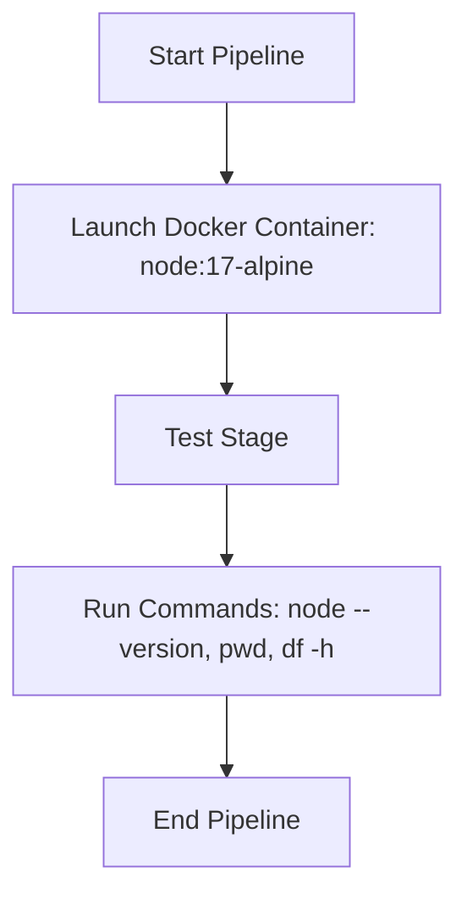

---

## 🚦 Pipeline Overview

This Jenkins pipeline runs a simple test inside a lightweight Node.js Docker container (`node:17-alpine`). It verifies Node.js installation and checks the container environment.

---

## 🛠️ Pipeline Code

```groovy
pipeline {
  agent {
    docker { image 'node:17-alpine' }
  }
  stages {
    stage('Test') {
      steps {
        sh 'node --version'
        sh 'pwd'
        sh 'df -h'
      }
    }
  }
}
````

---

## 🔎 Explanation

| Section                  | Details                                                          |
| ------------------------ | ---------------------------------------------------------------- |
| `agent { docker }`       | Runs the entire pipeline inside the specified Docker container.  |
| `image 'node:17-alpine'` | Uses official Node.js version 17 on Alpine Linux (small & fast). |
| `stage('Test')`          | A single stage named “Test” to perform the checks.               |
| `sh 'node --version'`    | Prints the Node.js version inside the container.                 |
| `sh 'pwd'`               | Shows the current directory where the pipeline runs.             |
| `sh 'df -h'`             | Displays disk space usage inside the container.                  |

---

## 🎯 Usage Instructions

1. Ensure Jenkins agents have Docker installed and Jenkins user has permission to run Docker commands.
2. Add this Jenkinsfile to your source code repo or create a Jenkins Pipeline job and paste the code.
3. Trigger the pipeline to run and watch the container-based steps execute.

---

## ⚠️ Troubleshooting

* **Docker not found:** Ensure Docker is installed on your Jenkins agent and that Jenkins has permission to execute Docker commands.
* **Permission denied running Docker:** Add the Jenkins user to the `docker` group (e.g., `sudo usermod -aG docker jenkins`) and restart Jenkins agent.
* **Pipeline fails to start:** Check Jenkins logs and pipeline console output for detailed errors.

---

## 🤝 Contributing

Contributions and improvements are welcome! Please submit issues or pull requests for enhancements or bug fixes.

---

## 📈 Pipeline Flow Diagram



---

## 📚 Resources

* [Jenkins Pipeline Documentation](https://www.jenkins.io/doc/book/pipeline/)
* [Docker Node.js Official Image](https://hub.docker.com/_/node)
* [Jenkins Docker Pipeline Plugin](https://plugins.jenkins.io/docker-workflow/)

---

*Happy building! 🚀*

```

---

